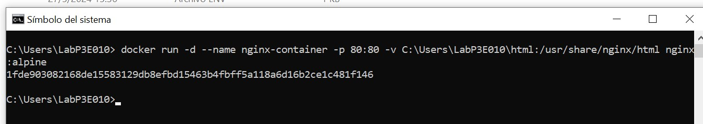
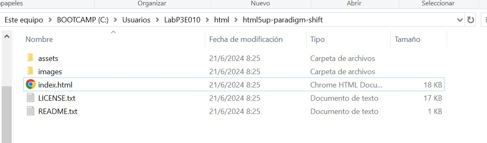
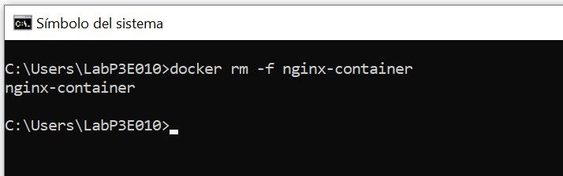

# VOLUMEN TIPO HOST
Un volumen host (o bind mount) es un tipo de volumen donde se monta un directorio o archivo específico del sistema de archivos del host en un contenedor.

```
docker run -d --name <nombre contenedor> -v <ruta carpeta host>:<ruta carpeta contenedor> <imagen> 
```

### Crear un volumen tipo host con la imagen nginx:alpine, mapear todos por puertos, para la ruta carpeta host: directorio en donde se encuentra la carpeta html en tu computador y para la ruta carpeta contenedor: /usr/share/nginx/html esta ruta se obtiene al revisar la documentación


# COMPLETAR CON EL COMANDO

### ¿Qué sucede al ingresar al servidor de nginx?
Al ingresar al servidor de nginx ocurre el error 403 forbidden lo que indica que el servidor niega la solicitud del cliente.


### ¿Qué pasa con el archivo index.html del contenedor?
Al crear el contenedor y el volumen no habia ningun archivo index.html por lo cual se creó, entonces, al crearlo ya carga normalmente.

### Ir a https://html5up.net/ y descargar un template gratuito, descomprirlo dentro de nginx/html

### ¿Qué sucede al ingresar al servidor de nginx?
Ahora carga la plantilla descargada dentro del servidor

### Eliminar el contenedor


### ¿Qué sucede al crear nuevamente el mismo contenedor con volumen de tipo host a los directorios definidos anteriormente?
Al recrear el contenedor con el mismo volumen tipo host después de eliminarlo, el contenido del directorio del contenedor se restaura.

### ¿Qué hace el comando pwd?
El comando pwd (print working directory) muestra el directorio de trabajo actual en la línea de comandos. 
# COMPLETAR CON LA RESPUESTA A LA PREGUNTA
Si quieres incluir el comando pwd dentro de un comando de Docker, lo puedes hacer de diferentes maneras dependiendo del shell que estés utilizando.


### Volumen tipo host usando PWD y PowerShell
```
docker run -d --name <nombre contenedor> --publish published=<valorPuertoHost>,target=<valor> -v ${PWD}/<ruta relativa>:<ruta absoluta> <nombre imagen>:<tag> 
```

### Volumen tipo host usando PWD (Git Bash)

```
docker run -d --name <nombre contenedor> --publish published=<valorPuertoHost>,target=<valor> -v $(pwd -W)/html:/usr/share/nginx/html <nombre imagen>:<tag> 
```

### Volumen tipo host usando PWD (en Linux)

```
docker run -d --name <nombre contenedor> --publish published=<valorPuertoHost>,target=<valor> -v $(pwd)/html:/usr/share/nginx/html <nombre imagen>:<tag> 
```

